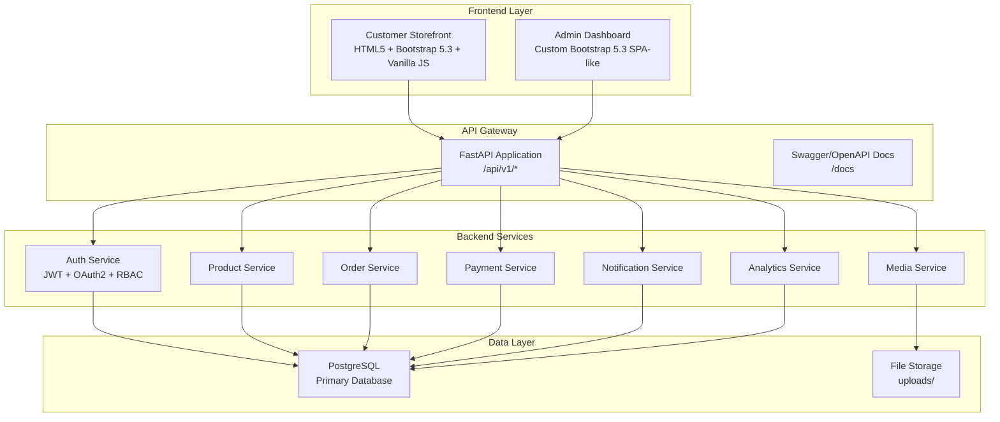
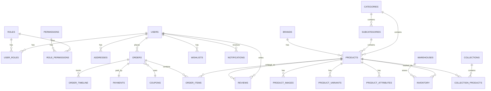

# ASAH'S PRIMENEST — Enterprise E-Commerce Platform

## Implementation Plan

Build a complete, production-ready enterprise e-commerce platform for **ASAH'S PRIMENEST** — a premium plumbing materials, household appliances, tools, and home improvement retailer.

---

## User Review Required

> [!IMPORTANT]
> **PostgreSQL Configuration**: The backend requires a running PostgreSQL instance. Please confirm:
> 1. Do you already have PostgreSQL installed locally, or should Docker handle everything?
> 2. Preferred database name? (Default: `primenest_db`)
> 3. Preferred PostgreSQL credentials? (Default will use `.env.example` template)

> [!IMPORTANT]
> **Payment Gateway Keys**: The plan prepares integration stubs for Paystack, Flutterwave, Stripe, MTN MoMo, Telecel Cash, and AirtelTigo Money. You'll need to supply your API keys before going live. I'll create a `.env.example` with all required variables.

> [!IMPORTANT]
> **Email Service**: For email verification, password reset, and email campaigns — which SMTP service do you plan to use? (Gmail SMTP, SendGrid, Mailgun, etc.) I'll create an abstraction layer that works with any provider.

> [!WARNING]
> **Project Scale**: This is a ~200+ file enterprise application. The implementation will be executed in phases. Each phase produces a fully functional increment. Estimated execution: 8-12 phases.

---

## Open Questions

1. **Domain/Hosting**: Do you have a domain name and hosting provider selected? This affects CORS configuration and deployment settings.
2. **Currency**: What's the primary currency? (GHS — Ghana Cedis assumed based on MTN MoMo / Telecel / AirtelTigo integrations)
3. **Multi-language**: Do you need multi-language support, or English only?
4. **SMS Notifications**: Do you want SMS notification support in addition to email?
5. **Blog**: Should the blog support rich text editing (WYSIWYG), or markdown?

---

## Architecture Overview



---

## Proposed Changes

### Phase 1: Project Foundation & Database

Sets up the entire project skeleton, database models (25+ tables), migrations, configuration, and Docker infrastructure.

---

#### [NEW] Project Root Files

| File | Purpose |
|------|---------|
| `docker-compose.yml` | PostgreSQL + FastAPI + Nginx orchestration |
| `README.md` | Full setup & deployment documentation |
| `.env.example` | All environment variable templates |
| `.gitignore` | Python/Node/Docker ignores |

---

#### [NEW] Backend Core (`backend/app/core/`)

| File | Purpose |
|------|---------|
| `config.py` | Pydantic `Settings` class, env loading |
| `security.py` | JWT creation/verification, password hashing (bcrypt) |
| `dependencies.py` | FastAPI dependency injection (DB session, current user, role checks) |
| `exceptions.py` | Custom exception classes + global handlers |
| `constants.py` | Enums (OrderStatus, PaymentStatus, UserRole, etc.) |

---

#### [NEW] Database Layer (`backend/app/database/`)

| File | Purpose |
|------|---------|
| `session.py` | SQLAlchemy async engine + session factory |
| `base.py` | Declarative base with common mixins (timestamps, soft-delete) |

---

#### [NEW] Models (`backend/app/models/`) — 25+ Tables

| Model File | Tables |
|------------|--------|
| `user.py` | `users`, `roles`, `permissions`, `role_permissions`, `user_roles` |
| `product.py` | `products`, `product_images`, `product_attributes`, `product_variants` |
| `category.py` | `categories`, `subcategories` |
| `brand.py` | `brands` |
| `collection.py` | `collections`, `collection_products` |
| `inventory.py` | `inventory`, `warehouses` |
| `customer.py` | `customers`, `addresses` |
| `order.py` | `orders`, `order_items`, `order_timeline` |
| `payment.py` | `payments` |
| `coupon.py` | `coupons`, `promotions` |
| `review.py` | `reviews` |
| `wishlist.py` | `wishlists` |
| `newsletter.py` | `newsletter_subscribers` |
| `testimonial.py` | `testimonials` |
| `content.py` | `hero_banners`, `blog_posts`, `media_library` |
| `settings.py` | `site_settings` |
| `audit.py` | `audit_logs`, `system_logs` |
| `notification.py` | `notifications` |

---

#### [NEW] Schemas (`backend/app/schemas/`) — Pydantic v2 Models

One schema file per model domain with `Create`, `Update`, `Response`, `List` variants.

---

#### [NEW] Repositories (`backend/app/repositories/`)

Generic CRUD repository pattern + domain-specific repositories for complex queries.

| File | Coverage |
|------|----------|
| `base.py` | Generic `CRUDRepository[T]` with pagination, search, sort, filter, bulk ops |
| `user_repo.py` | User + role management |
| `product_repo.py` | Product CRUD + filtering + search |
| `order_repo.py` | Order lifecycle management |
| `analytics_repo.py` | Dashboard aggregations |

---

#### [NEW] Services (`backend/app/services/`)

Business logic layer between routers and repositories.

| File | Responsibility |
|------|---------------|
| `auth_service.py` | Login, register, token refresh, password reset, email verification |
| `user_service.py` | User CRUD, role assignment, profile management |
| `product_service.py` | Product CRUD, image management, inventory checks |
| `category_service.py` | Category/subcategory tree management |
| `order_service.py` | Order creation, status transitions, timeline |
| `payment_service.py` | Payment processing abstraction (Paystack/Flutterwave/Stripe) |
| `cart_service.py` | Cart management, coupon application, shipping calc |
| `analytics_service.py` | Dashboard metrics, chart data, report generation |
| `export_service.py` | CSV, Excel, PDF export generation |
| `media_service.py` | Image upload, compression, thumbnail generation |
| `notification_service.py` | Email sending, in-app notifications |
| `search_service.py` | Full-text search across products, orders, customers |

---

### Phase 2: Authentication & API Routes

#### [NEW] Auth Module (`backend/app/auth/`)

| File | Purpose |
|------|---------|
| `oauth2.py` | OAuth2 password bearer scheme |
| `jwt_handler.py` | Access + refresh token management |
| `rbac.py` | Role-based permission decorator/dependency |

---

#### [NEW] API Routers (`backend/app/routers/`)

All routes prefixed with `/api/v1/`

| Router File | Endpoints |
|-------------|-----------|
| `auth.py` | `/auth/login`, `/auth/register`, `/auth/refresh`, `/auth/forgot-password`, `/auth/reset-password`, `/auth/verify-email` |
| `users.py` | Full CRUD + role management |
| `products.py` | Full CRUD + image upload + bulk import/export + search/filter |
| `categories.py` | Full CRUD + subcategories + tree structure |
| `brands.py` | Full CRUD |
| `collections.py` | Full CRUD + product association |
| `inventory.py` | Stock management + warehouse CRUD |
| `orders.py` | Full lifecycle + timeline + invoices |
| `payments.py` | Payment initiation + webhook callbacks |
| `customers.py` | Full CRUD + address management |
| `reviews.py` | Full CRUD + moderation |
| `coupons.py` | Full CRUD + validation |
| `wishlist.py` | Add/remove/list |
| `cart.py` | Add/update/remove/checkout |
| `analytics.py` | Dashboard metrics + chart data |
| `content.py` | Banners + blog + testimonials + media |
| `settings.py` | Site settings CRUD |
| `export.py` | CSV/Excel/PDF generation endpoints |
| `notifications.py` | List/mark-read/clear |
| `audit.py` | Audit log viewing + system logs |

---

#### [NEW] Middleware (`backend/app/middleware/`)

| File | Purpose |
|------|---------|
| `cors.py` | CORS configuration |
| `rate_limit.py` | Request rate limiting |
| `audit_log.py` | Automatic audit trail for mutations |
| `error_handler.py` | Global exception handling with consistent JSON |

---

#### [NEW] Main Application (`backend/app/main.py`)

FastAPI app factory with middleware registration, router inclusion, static file serving, and Jinja2 template rendering for server-side pages.

---

### Phase 3: Customer-Facing Storefront

#### [NEW] Frontend Assets (`frontend/`)

```
frontend/
├── assets/
│   └── logo.png
├── css/
│   ├── main.css          — Design system (variables, typography, layout)
│   ├── components.css    — Reusable component styles
│   ├── navbar.css        — Sticky mega-menu navbar
│   ├── hero.css          — Hero banner with animations
│   ├── products.css      — Product cards, grids, detail pages
│   ├── cart.css           — Cart & checkout styles
│   ├── auth.css           — Login/register forms
│   ├── dashboard.css      — Customer dashboard
│   └── responsive.css     — Breakpoint overrides
├── js/
│   ├── app.js            — Main initialization, router
│   ├── api.js            — Axios HTTP client wrapper
│   ├── auth.js           — Login/register/token management
│   ├── navbar.js         — Mega menu, search, cart badge
│   ├── hero.js           — Hero carousel (Swiper.js)
│   ├── products.js       — Product listing, filters, AJAX search
│   ├── product-detail.js — Gallery, variants, reviews, add-to-cart
│   ├── cart.js           — Cart management, coupon, shipping calc
│   ├── checkout.js       — Checkout flow, payment integration
│   ├── wishlist.js       — Wishlist toggle
│   ├── dashboard.js      — Customer dashboard tabs
│   ├── compare.js        — Product comparison
│   └── utils.js          — Formatters, validators, toast notifications
├── pages/
│   ├── index.html        — Homepage
│   ├── shop.html         — Product listing with filters
│   ├── product.html      — Product detail page
│   ├── cart.html          — Shopping cart
│   ├── checkout.html     — Checkout page
│   ├── login.html        — Login
│   ├── register.html     — Registration
│   ├── forgot-password.html
│   ├── dashboard.html    — Customer dashboard (profile, orders, addresses, wishlist)
│   ├── compare.html      — Product comparison
│   ├── wishlist.html      — Wishlist page
│   ├── order-tracking.html
│   ├── about.html
│   ├── contact.html
│   └── 404.html
└── images/
    └── (generated product/category images)
```

---

### Phase 4: Admin Dashboard

#### [NEW] Admin Frontend (`frontend/admin/`)

Custom-built admin dashboard inspired by Shopify Admin — dark sidebar, clean data tables, chart widgets.

```
frontend/admin/
├── css/
│   ├── admin.css          — Admin design system
│   ├── sidebar.css        — Collapsible nested sidebar
│   ├── dashboard.css      — KPI cards, charts
│   ├── datatables.css     — Custom data table styling
│   └── forms.css          — Admin form styling
├── js/
│   ├── admin-app.js       — Admin initialization
│   ├── admin-api.js       — Admin API client
│   ├── sidebar.js         — Sidebar navigation
│   ├── dashboard.js       — Chart.js dashboards
│   ├── datatables.js      — CRUD data tables with bulk actions
│   ├── products.js        — Product management
│   ├── orders.js          — Order management
│   ├── customers.js       — Customer management
│   ├── categories.js      — Category management
│   ├── coupons.js         — Coupon management
│   ├── content.js         — Content management
│   ├── analytics.js       — Analytics & reports
│   ├── settings.js        — Site settings
│   ├── media.js           — Media library
│   ├── export.js          — Export functionality
│   └── audit.js           — Audit/system logs
└── pages/
    ├── dashboard.html     — Main admin dashboard
    ├── products.html      — Product list + CRUD
    ├── product-form.html  — Product create/edit form
    ├── categories.html    — Category management
    ├── brands.html        — Brand management
    ├── collections.html   — Collection management
    ├── orders.html        — Order list + detail
    ├── order-detail.html  — Order timeline + actions
    ├── customers.html     — Customer list
    ├── reviews.html       — Review moderation
    ├── coupons.html       — Coupon management
    ├── promotions.html    — Promotion management
    ├── banners.html       — Hero banner management
    ├── blog.html          — Blog management
    ├── testimonials.html  — Testimonial management
    ├── media.html         — Media library
    ├── analytics.html     — Analytics dashboards
    ├── reports.html       — Report generation
    ├── settings.html      — Site settings
    ├── users.html         — User & role management
    ├── audit-logs.html    — Audit trail viewer
    ├── system-logs.html   — System log viewer
    └── profile.html       — Admin profile
```

---

### Phase 5: Seed Data & Migrations

#### [NEW] Alembic Migrations (`backend/alembic/`)

| File | Purpose |
|------|---------|
| `alembic.ini` | Migration configuration |
| `env.py` | SQLAlchemy metadata binding |
| `versions/001_initial.py` | Full schema creation |

---

#### [NEW] Seed Script (`backend/seed.py`)

Realistic demo data:
- 3 admin users, 10 customers
- 15 categories, 40 subcategories
- 20 brands
- 150+ products with images, variants, specs
- 50 orders across all statuses
- 30 reviews
- 10 coupons
- 5 hero banners
- Newsletter subscribers
- Testimonials

---

### Phase 6: Testing

#### [NEW] Test Suite (`backend/tests/`)

| File | Coverage |
|------|----------|
| `conftest.py` | Test DB, client fixture, auth fixtures |
| `test_auth.py` | Registration, login, refresh, password reset |
| `test_products.py` | Full CRUD + search + filter |
| `test_categories.py` | Full CRUD + tree |
| `test_orders.py` | Order lifecycle |
| `test_payments.py` | Payment flow |
| `test_cart.py` | Cart operations |
| `test_admin.py` | Admin-only endpoints + RBAC |
| `test_export.py` | CSV/Excel/PDF generation |

---

### Phase 7: Deployment & Documentation

#### [NEW] Docker Configuration

| File | Purpose |
|------|---------|
| `backend/Dockerfile` | Python 3.11 + FastAPI |
| `docker-compose.yml` | PostgreSQL + App + Nginx |
| `nginx/nginx.conf` | Reverse proxy + static serving |

#### [NEW] Documentation (`docs/`)

| File | Content |
|------|---------|
| `API.md` | API endpoint reference |
| `DEPLOYMENT.md` | Production deployment guide |
| `DEVELOPMENT.md` | Local development setup |

---

## Database Schema



---

## Color System

| Token | Hex | Usage |
|-------|-----|-------|
| `--primary` | `#F2660F` | CTAs, accents, highlights, active states |
| `--dark` | `#121010` | Backgrounds, text, admin sidebar |
| `--secondary` | `#DBD2CB` | Borders, muted elements, cards |
| `--white` | `#F6F9F9` | Page backgrounds, card backgrounds |
| `--primary-light` | `#FF8534` | Hover states, gradients |
| `--primary-dark` | `#D4570D` | Active/pressed states |
| `--success` | `#10B981` | Success states, delivered orders |
| `--warning` | `#F59E0B` | Warnings, pending states |
| `--danger` | `#EF4444` | Errors, cancelled orders |
| `--info` | `#3B82F6` | Info badges, processing states |

---

## Verification Plan

### Automated Tests
```bash
# Run full test suite
cd backend && python -m pytest tests/ -v --tb=short

# Run with coverage
cd backend && python -m pytest tests/ --cov=app --cov-report=html
```

### Manual Verification
1. Start the application with `docker-compose up`
2. Navigate to `http://localhost:8000` — verify storefront loads
3. Navigate to `http://localhost:8000/admin` — verify admin dashboard loads
4. Navigate to `http://localhost:8000/docs` — verify Swagger API docs
5. Test user registration → email verification → login flow
6. Test product browsing → add to cart → checkout flow
7. Test admin CRUD operations across all modules
8. Test export functionality (CSV, Excel, PDF)
9. Test responsive layouts on mobile/tablet/desktop
10. Verify all Chart.js dashboards render with seeded data

### Production Readiness Checklist
- [ ] All API endpoints return correct status codes
- [ ] JWT authentication works with refresh tokens
- [ ] RBAC prevents unauthorized access
- [ ] All forms validate on client and server
- [ ] File uploads work with size/type restrictions
- [ ] Database queries are optimized with indexes
- [ ] Error handling returns user-friendly messages
- [ ] Docker containers build and run successfully
- [ ] Database migrations run cleanly
- [ ] Seed data populates all tables correctly

---

## Execution Order

| Phase | Focus | Deliverables |
|-------|-------|-------------|
| 1 | Foundation | Project skeleton, all models, DB schema, config, Docker |
| 2 | Auth & API | JWT auth, all API routers, middleware, RBAC |
| 3 | Storefront | Homepage, shop, product detail, cart, checkout, auth pages |
| 4 | Admin | Full admin dashboard with all CRUD modules |
| 5 | Seed & Migrate | Alembic migrations, realistic demo data |
| 6 | Testing | Automated test suite for all endpoints |
| 7 | Deploy & Docs | Docker, Nginx, documentation, QA report |
